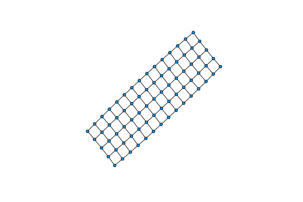
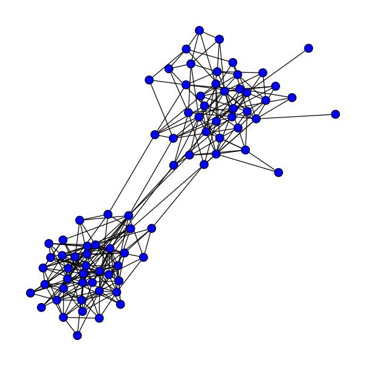
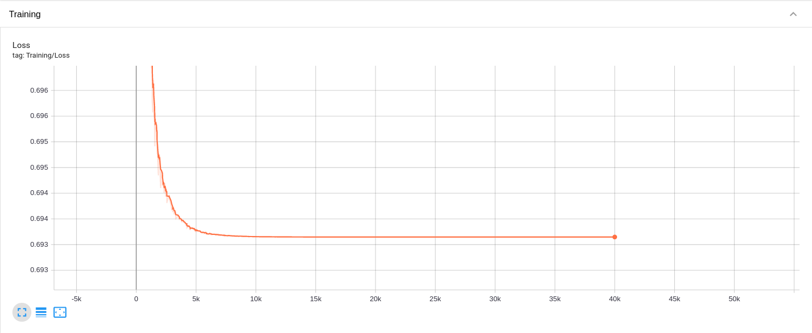
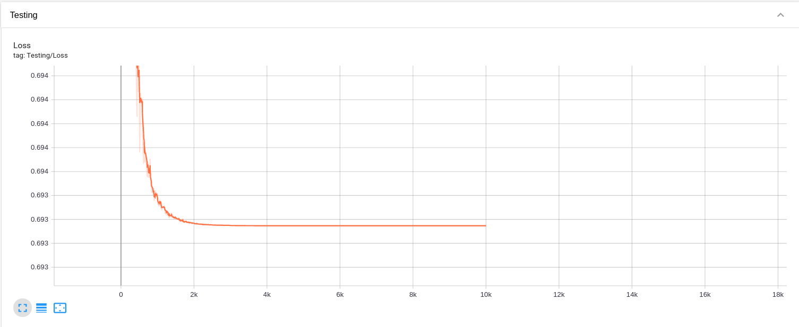
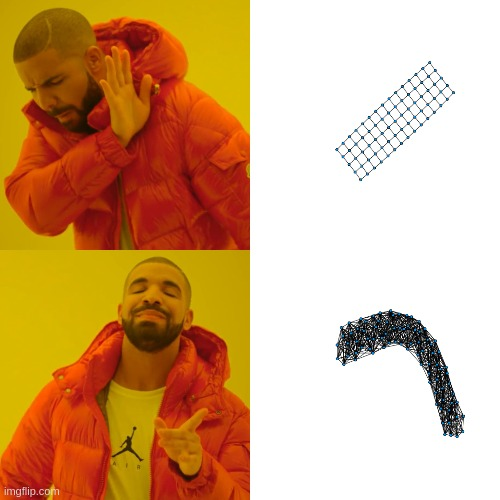

# GraphRNN

GraphRNN is a Julia re-implementation of the [GraphRNN: Generating Realistic Graphs with Deep Auto-regressive Models](https://arxiv.org/pdf/1802.08773.pdf) paper. 

## Overview
The project has the following files:
* [data_helper.jl](data_helpers.jl) (support file): handling encode/decode adjacency matrix, BFS ordering, transforming list of adjacency matrix to training format.
* [graph_generator.jl](graph_generator.jl) (support file): generating different types of graph and other utilities such as getting the biggest component.
  * include [data_helper.jl](data_helpers.jl)
* [graph_visualization.jl](graph_visualization.jl) (support file): handling graph visualization.
* [tsb_logger.jl](tsb_logger.jl) (support file): handling creating TensorBoard logger, used in train.jl.
* [configs/test.yaml](configs/test.yaml): containing configuration parameters, can be directly modified based on the need of user.  
  
* [data.jl](data.jl) (main file): creating/loading data sets for different type of graphs.
  * include [graph_generator.jl](graph_generator.jl)
* [model.jl](model.jl) (main file): containing GraphRNN model definition.
* [train.jl](train.jl) (main file): containing the main function which handles loading the data set, training, and inferencing. 
  * include [data_helper.jl](data_helpers.jl), [graph_visualization.jl](graph_visualization.jl), [tsb_logger.jl](tsb_logger.jl), [data.jl](data.jl), [model.jl](model.jl).

## Installation

To install dependencies, please run `julia packages.jl`.

## Generate Dataset

Our project supports creating data set for 4 types of graphs: SBM model, Complete Bipartite, Ladder, and Grid. To create a single graph, you can use function in [graph_generator.jl](graph_generator.jl). To create a new data set for a specific type of graphs, you can use function in [data.jl](data.jl). There will be 2 files being generated, the training data and the metadata of those training data. User can load these files using two load functions in [data.jl](data.jl). To visualize a graph, you can use function in [graph_visualization.jl](graph_visualization.jl).  

## Train & Inference

For more details, please refer to our [interactive tutorial](tutorial.ipynb)

Overall, using the configuration in our `configs/test.yaml`, we noticed that our loss converged too quickly. 

Moreover, qualitative evaluation does not yield good results. After training for 100 epochs on the 2D grid dataset,
we obtained very poor predictions from the model.

We believe that by expanding the size of the model, these results will be improved significantly. We are working to 
facilitate stacking GRU layers in our GraphRNN implementation. 

## License
GraphRNN is released under the [GNU General Public License](LICENSE).

## References
Jiaxuan  You  et  al.  “GraphRNN:  A  Deep  Generative  Model  for  Graphs”.  In:  (Feb.2018).url:https://arxiv.org/pdf/1802.08773.pdf.

